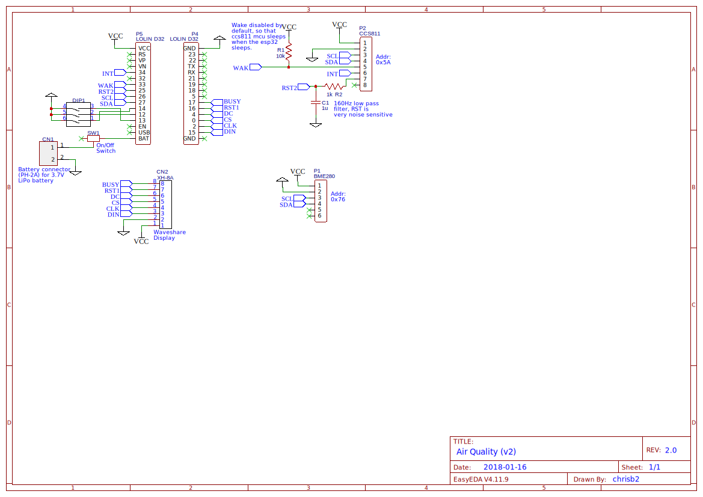
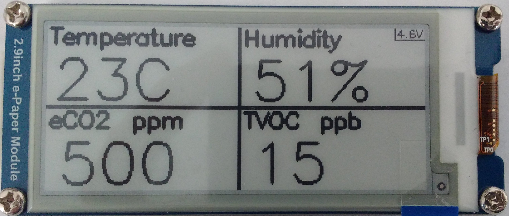

# air-quality
An air quality sensor and display. Uses the [BME280](https://www.bosch-sensortec.com/bst/products/all_products/bme280) and [CCS811](https://ams.com/ccs811) sensors to read temperature, relative humidity, equivalent CO2 (eCO2) and Total Volatile Organic Compound (TVOC) and displays the values on a [2.9in Waveshare](https://www.waveshare.com/product/2.9inch-e-paper-module.htm) e-Paper display.

## Schematic

If the schematic appears to be missing details, download it and view it locally, or zoom the web page.

## Installation

The program has been written and tested with the standard [esp32 Micropython firmware](http://micropython.org/download#esp32) installed on a [Lolin D32](https://wiki.wemos.cc/products:d32:d32) development board, although with some adjustments I would expect it to work on other esp32 boards and on the esp8266.

To install; flash the standard esp32 Micropython firmware, then copy all the Python files to the esp32 and reset the esp32.

## Usage

The CCS811 sensor must be 'burned-in' (see data sheet) for at least 1 hour (newer CCS811 firmware), or 48 hours (older CCS811 firmware). To do this simply leave powered on for the appropriate time.

In addition the CCS811 sensor must be 'conditioned' for 20 minutes before accurate readings are generated (see data sheet). During this period the display will show a long dash for the eCO2 and TVOC values.

The display is refreshed once per minute with the esp32 and display in deep sleep in the interval between refreshes.

The battery voltage is displayed in the top right hand corner of the display.

## CCS811 Firmware Upgrade

**WARNING - DO THIS AT YOUR OWN RISK, IT MAY BRICK THE SENSOR**

The Python program _ccs811_firmware_upgrade.py_ can be used to upgrade the CCS811 firmware, it is based on the ams application note AN000371: Downloading new Application Firmware (v2). Download the firmware binary from the ams website, copy to the esp32 and run the program.
